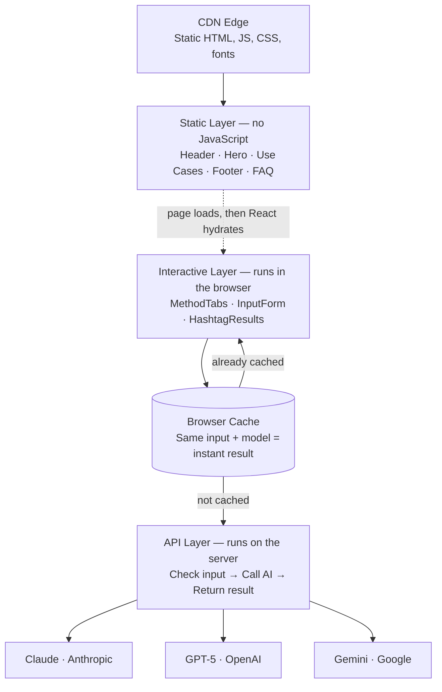

# HashtagGeneratorPro

AI-powered hashtag generator that lets you paste any text and get relevant, high-performing hashtags in seconds. Compare results from three frontier AI models — Claude Opus, GPT-5, and Gemini — side by side.

## Quick Start

```bash
# 1. Install dependencies
npm install

# 2. Copy env template and add your API keys
cp .env.example .env

# 3. Start the dev server
npm run dev
```

Open [http://localhost:3000](http://localhost:3000).

## API Keys

You need at least one API key to use the generator. Get them here:

| Provider | Key | Sign up |
|----------|-----|---------|
| Anthropic (Claude) | `ANTHROPIC_API_KEY` | [console.anthropic.com](https://console.anthropic.com/) |
| OpenAI (GPT-5) | `OPENAI_API_KEY` | [platform.openai.com](https://platform.openai.com/api-keys) |
| Google (Gemini) | `GOOGLE_AI_API_KEY` | [aistudio.google.com](https://aistudio.google.com/apikey) |

Add them to your `.env` file:

```
ANTHROPIC_API_KEY=sk-ant-...
OPENAI_API_KEY=sk-...
GOOGLE_AI_API_KEY=AI...
```

## Scripts

| Command | Description |
|---------|-------------|
| `npm run dev` | Start dev server with Turbopack |
| `npm run dev:fresh` | Kill port 3000 and start fresh |
| `npm run build` | Production build |
| `npm run start` | Serve production build |
| `npm run type-check` | TypeScript check without emitting |
| `npm test` | Run test suite (single run, CI-ready) |
| `npm run test:watch` | Run tests in interactive watch mode |

## Architecture

The app has three layers: a static marketing page, an interactive client, and a server-side API. Each layer has a distinct job and they communicate in one direction — the page loads, the client hydrates on top of it, and when the user clicks "Generate," the client sends a request to the API.

### Static layer

The header, hero section, use cases, footer, FAQ, and structured data are all plain HTML generated at build time. No JavaScript is sent to the browser for these parts. Search engines can crawl them without executing any code, and they load instantly from a CDN edge node close to the user.

### Interactive layer

The hashtag generator itself — the model selector tabs, the text input form, and the results display — is a React app that loads on top of the static HTML. It runs entirely in the browser. When the user has generated hashtags before with the same text and model, the result is stored in the browser's `localStorage` and returned instantly without contacting the server.

### API layer — what happens when you click "Generate"

When the user clicks "Generate Hashtags," the browser sends a request to the server in the background. The page doesn't freeze or navigate away — the user sees a loading spinner and can continue interacting with the page.

On the server, the request goes through three steps:

1. **Check the input** — Is the selected model valid? Is the text long enough? Is it too long? If anything is wrong, the server sends back an error immediately, before contacting any AI provider. This keeps things fast and avoids wasting API calls on bad input.

2. **Call the AI provider** — The server looks up which AI model the user selected (Claude, GPT-5, or Gemini) and sends the text to that provider's API. Each provider is completely independent — it has its own API key, its own rate limits, and its own error handling. If Claude is overloaded, the user can switch to GPT-5 or Gemini and try again. The API keys are stored on the server and never sent to the browser.

3. **Return the result** — If the AI provider responds successfully, the server sends the hashtags back to the browser. If something goes wrong, the server figures out what kind of error it was (rate limiting, missing API key, or a provider failure) and sends back a clear error message so the UI can show the user what happened and what to do about it.



## Tech Stack

| Layer | Technology |
|-------|-----------|
| Framework | Next.js 15 (App Router) |
| UI | React 19 |
| Language | TypeScript 5 |
| Styling | Tailwind CSS 4 |
| AI | Anthropic SDK, OpenAI SDK, Google Generative AI SDK |
| Deployment | Vercel / any Node.js host |

## SEO

The app is optimized for search engine visibility and domain authority:

- **Metadata** — `app/layout.tsx` sets `metadataBase`, page title, description, keywords, canonical URL, OpenGraph tags, and Twitter card tags. All point to the production domain `https://hashtag-generator-pro.vercel.app`.
- **Structured data** — `components/JsonLd.tsx` embeds four JSON-LD schemas: `WebApplication` (with aggregate rating), `FAQPage` (5 questions), `HowTo` (4 steps), and `BreadcrumbList`. These enable rich results in Google Search.
- **Sitemap** — `app/sitemap.ts` generates `sitemap.xml` with the production URL and monthly change frequency.
- **Robots** — `app/robots.ts` generates `robots.txt` allowing all crawlers and pointing to the sitemap.
- **Static HTML** — Static components render to pure HTML at build time, making all content (hero, features, FAQ, use cases) fully crawlable without JavaScript execution.
- **Semantic headings** — Proper `h1` > `h2` > `h3` hierarchy throughout the page for content structure signals.

## Accessibility

The app targets WCAG 2.1 Level AA compliance:

- **Skip link** — "Skip to generator" link at the top of the page, visible on focus, jumps past the navigation to the main interactive content.
- **Keyboard navigation** — Full keyboard support throughout. The tab selector implements the WAI-ARIA Tabs pattern with `ArrowLeft`/`ArrowRight` to move between tabs, `Home`/`End` to jump to first/last, and proper `tabIndex` roving.
- **ARIA attributes** — `role="tablist"`, `role="tab"`, `role="tabpanel"` with `aria-selected`, `aria-controls`, and `aria-labelledby` linking. Form inputs use `aria-invalid`, `aria-describedby`, and `aria-busy`. Loading state uses `role="status"` with `aria-live="polite"`, errors use `role="alert"`.
- **Color contrast** — All text meets WCAG AA contrast ratios (4.5:1 for normal text, 3:1 for large text). The custom theme palette was chosen for accessibility.
- **Motion** — `prefers-reduced-motion` media query disables animations and transitions for users who request it.
- **Semantic HTML** — Proper heading hierarchy (`h1` > `h2` > `h3`), `<nav>`, `<main>`, `<footer>` landmarks, `<form>` with associated `<label>` elements, and `<button>` elements with explicit `type` attributes.
- **Live regions** — Character count and validation messages update via ARIA live regions so screen readers announce changes without requiring focus.

## File Structure

```
HashtagGeneratorPro/
├── __tests__/
│   ├── api/generate.test.ts        # API route validation + error handling
│   ├── components/
│   │   ├── InputForm.test.tsx       # Form validation + callbacks
│   │   ├── MethodTabs.test.tsx      # Tab selector + keyboard nav
│   │   └── StatusMessage.test.tsx   # Loading + error states
│   └── lib/
│       ├── cache.test.ts            # localStorage cache logic
│       ├── parse-hashtags.test.ts   # LLM output parser
│       └── prompts.test.ts          # Prompt construction
├── app/
│   ├── layout.tsx              # Root layout, fonts, metadata, skip link
│   ├── page.tsx                # Hero, feature bar, use cases, architecture
│   ├── globals.css             # Tailwind v4 theme, animations, accessibility
│   ├── sitemap.ts              # Generated sitemap.xml
│   ├── robots.ts               # Generated robots.txt
│   ├── not-found.tsx           # Custom 404
│   └── api/generate/
│       └── route.ts            # POST handler: validate → dispatch → respond (server-side only)
├── components/
│   ├── NavBar.tsx              # Responsive nav with mobile hamburger menu
│   ├── HashtagGenerator.tsx    # Client: top-level orchestrator
│   ├── MethodTabs.tsx          # Client: accessible tab selector
│   ├── InputForm.tsx           # Client: form inputs + file upload
│   ├── HashtagResults.tsx      # Client: hashtag chips + copy
│   ├── StatusMessage.tsx       # Client: loading + error states
│   ├── FaqAccordion.tsx        # Client: animated accordion
│   ├── Footer.tsx              # Static: how-it-works, FAQ, accessibility
│   ├── JsonLd.tsx              # Static: 4 structured data schemas
│   └── ArchitectureDiagram.tsx # Static: inline SVG architecture diagram
├── lib/
│   ├── types.ts                # Shared types and constants
│   ├── prompts.ts              # System prompt + user prompt builder
│   ├── parse-hashtags.ts       # LLM output parser
│   ├── clipboard.ts            # Copy-to-clipboard utility
│   ├── cache.ts                # SHA-256 localStorage cache
│   └── providers/
│       ├── claude.ts           # Server-only: Anthropic SDK
│       ├── openai.ts           # Server-only: OpenAI SDK
│       ├── gemini.ts           # Server-only: Google AI SDK
│       └── index.ts            # Provider registry + dispatch
├── hooks/
│   ├── useHashtagGenerator.ts  # Cache → API → state management
│   └── useLocalStorage.ts      # Persistent localStorage with debounce
└── docs/
    └── ARCHITECTURE.md         # Detailed internal architecture docs
```

## Testing

52 tests across 7 files using **Vitest**, **React Testing Library**, and **jsdom**. All tests are deterministic — no API keys, running server, or browser needed.

| Test file | What it covers |
|-----------|---------------|
| `__tests__/lib/parse-hashtags.test.ts` | `#tag` extraction, lowercase, dedup, comma/newline fallback, max limit |
| `__tests__/lib/prompts.test.ts` | System prompt content, `buildUserPrompt` with/without title |
| `__tests__/lib/cache.test.ts` | Cache key hashing, hit/miss, TTL expiry, clearCache, LRU eviction |
| `__tests__/api/generate.test.ts` | Input validation, missing API key, success path, rate limiting, provider errors |
| `__tests__/components/MethodTabs.test.tsx` | Tab rendering, aria-selected, click, keyboard navigation, panel ARIA linking |
| `__tests__/components/InputForm.test.tsx` | Labels, disabled state, validation warnings, callbacks, submit guard |
| `__tests__/components/StatusMessage.test.tsx` | Idle null render, loading spinner, error alert, error-over-loading priority |

```bash
npm test          # CI: exits 0 on pass, 1 on fail
npm run test:watch  # Dev: re-runs on file changes
```
