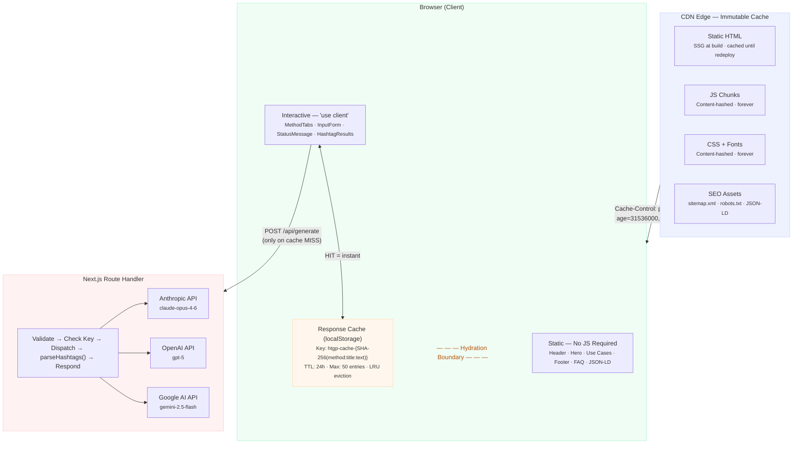

# HashtagGeneratorPro

AI-powered hashtag generator that lets you paste any text and get relevant, high-performing hashtags in seconds. Compare results from three frontier AI models — Claude Opus, GPT-5, and Gemini — side by side.

## Quick Start

```bash
# 1. Install dependencies
npm install

# 2. Copy env template and add your API keys
cp .env.example .env

# 3. Start the dev server
npm run dev
```

Open [http://localhost:3000](http://localhost:3000).

## API Keys

You need at least one API key to use the generator. Get them here:

| Provider | Key | Sign up |
|----------|-----|---------|
| Anthropic (Claude) | `ANTHROPIC_API_KEY` | [console.anthropic.com](https://console.anthropic.com/) |
| OpenAI (GPT-5) | `OPENAI_API_KEY` | [platform.openai.com](https://platform.openai.com/api-keys) |
| Google (Gemini) | `GOOGLE_AI_API_KEY` | [aistudio.google.com](https://aistudio.google.com/apikey) |

Add them to your `.env` file:

```
ANTHROPIC_API_KEY=sk-ant-...
OPENAI_API_KEY=sk-...
GOOGLE_AI_API_KEY=AI...
```

## Scripts

| Command | Description |
|---------|-------------|
| `npm run dev` | Start dev server with Turbopack |
| `npm run dev:fresh` | Kill port 3000 and start fresh |
| `npm run build` | Production build |
| `npm run start` | Serve production build |
| `npm run type-check` | TypeScript check without emitting |
| `npm test` | Run test suite (single run, CI-ready) |
| `npm run test:watch` | Run tests in interactive watch mode |

## Architecture

The app is built on a static/dynamic split:

- **Static** (Server Components) — Header, hero, use cases, footer, FAQ, JSON-LD structured data. Rendered to pure HTML at build time, served from CDN edge, fully crawlable with zero client JS.
- **Interactive** (Client Components) — The hashtag generator form, tab selector, results display. Hydrated with React on the client after the static HTML paints.
- **API Route** — `POST /api/generate` validates input, dispatches to the selected AI provider, parses the response, and returns hashtags. API keys never leave the server.

### Caching

Two tiers of caching minimize load:

1. **CDN Edge** — All static assets (HTML, JS, CSS, fonts) are served with immutable cache headers from edge nodes globally.
2. **Browser** — AI responses are cached in `localStorage` using SHA-256 content-addressed keys (`htgp-cache-{hash}`). Same input + same model = instant result with no API call. TTL: 24 hours, max 50 entries, LRU eviction.



### Rate Limiting

Each AI provider is isolated with its own API key and independent rate limits. If Anthropic is rate-limited, OpenAI and Google remain available. HTTP 429 responses from any provider are caught and returned to the client as a `RATE_LIMITED` error with the provider's message.

## Tech Stack

| Layer | Technology |
|-------|-----------|
| Framework | Next.js 15 (App Router) |
| UI | React 19 |
| Language | TypeScript 5 |
| Styling | Tailwind CSS 4 |
| AI | Anthropic SDK, OpenAI SDK, Google Generative AI SDK |
| Deployment | Vercel / any Node.js host |

## SEO

The app is optimized for search engine visibility and domain authority:

- **Metadata** — `app/layout.tsx` sets `metadataBase`, page title, description, keywords, canonical URL, OpenGraph tags, and Twitter card tags. All point to the production domain `https://hashtag-generator-pro.vercel.app`.
- **Structured data** — `components/JsonLd.tsx` embeds four JSON-LD schemas: `WebApplication` (with aggregate rating), `FAQPage` (5 questions), `HowTo` (4 steps), and `BreadcrumbList`. These enable rich results in Google Search.
- **Sitemap** — `app/sitemap.ts` generates `sitemap.xml` with the production URL and monthly change frequency.
- **Robots** — `app/robots.ts` generates `robots.txt` allowing all crawlers and pointing to the sitemap.
- **Static HTML** — Server Components render to pure HTML at build time, making all content (hero, features, FAQ, use cases) fully crawlable without JavaScript execution.
- **Semantic headings** — Proper `h1` > `h2` > `h3` hierarchy throughout the page for content structure signals.

## Accessibility

The app targets WCAG 2.1 Level AA compliance:

- **Skip link** — "Skip to generator" link at the top of the page, visible on focus, jumps past the navigation to the main interactive content.
- **Keyboard navigation** — Full keyboard support throughout. The tab selector implements the WAI-ARIA Tabs pattern with `ArrowLeft`/`ArrowRight` to move between tabs, `Home`/`End` to jump to first/last, and proper `tabIndex` roving.
- **ARIA attributes** — `role="tablist"`, `role="tab"`, `role="tabpanel"` with `aria-selected`, `aria-controls`, and `aria-labelledby` linking. Form inputs use `aria-invalid`, `aria-describedby`, and `aria-busy`. Loading state uses `role="status"` with `aria-live="polite"`, errors use `role="alert"`.
- **Color contrast** — All text meets WCAG AA contrast ratios (4.5:1 for normal text, 3:1 for large text). The custom theme palette was chosen for accessibility.
- **Motion** — `prefers-reduced-motion` media query disables animations and transitions for users who request it.
- **Semantic HTML** — Proper heading hierarchy (`h1` > `h2` > `h3`), `<nav>`, `<main>`, `<footer>` landmarks, `<form>` with associated `<label>` elements, and `<button>` elements with explicit `type` attributes.
- **Live regions** — Character count and validation messages update via ARIA live regions so screen readers announce changes without requiring focus.

## File Structure

```
HashtagGeneratorPro/
├── __tests__/
│   ├── api/generate.test.ts        # API route validation + error handling
│   ├── components/
│   │   ├── InputForm.test.tsx       # Form validation + callbacks
│   │   ├── MethodTabs.test.tsx      # Tab selector + keyboard nav
│   │   └── StatusMessage.test.tsx   # Loading + error states
│   └── lib/
│       ├── cache.test.ts            # localStorage cache logic
│       ├── parse-hashtags.test.ts   # LLM output parser
│       └── prompts.test.ts          # Prompt construction
├── app/
│   ├── layout.tsx              # Root layout, fonts, metadata, skip link
│   ├── page.tsx                # Hero, feature bar, use cases, architecture
│   ├── globals.css             # Tailwind v4 theme, animations, accessibility
│   ├── sitemap.ts              # Generated sitemap.xml
│   ├── robots.ts               # Generated robots.txt
│   ├── not-found.tsx           # Custom 404
│   └── api/generate/
│       └── route.ts            # POST handler: validate → dispatch → respond
├── components/
│   ├── NavBar.tsx              # Responsive nav with mobile hamburger menu
│   ├── HashtagGenerator.tsx    # Client: top-level orchestrator
│   ├── MethodTabs.tsx          # Client: accessible tab selector
│   ├── InputForm.tsx           # Client: form inputs + file upload
│   ├── HashtagResults.tsx      # Client: hashtag chips + copy
│   ├── StatusMessage.tsx       # Client: loading + error states
│   ├── FaqAccordion.tsx        # Client: animated accordion
│   ├── Footer.tsx              # Server: how-it-works, FAQ, accessibility
│   ├── JsonLd.tsx              # Server: 4 structured data schemas
│   └── ArchitectureDiagram.tsx # Server: inline SVG architecture diagram
├── lib/
│   ├── types.ts                # Shared types and constants
│   ├── prompts.ts              # System prompt + user prompt builder
│   ├── parse-hashtags.ts       # LLM output parser
│   ├── clipboard.ts            # Copy-to-clipboard utility
│   ├── cache.ts                # SHA-256 localStorage cache
│   └── providers/
│       ├── claude.ts           # Server-only: Anthropic SDK
│       ├── openai.ts           # Server-only: OpenAI SDK
│       ├── gemini.ts           # Server-only: Google AI SDK
│       └── index.ts            # Provider registry + dispatch
├── hooks/
│   ├── useHashtagGenerator.ts  # Cache → API → state management
│   └── useLocalStorage.ts      # Persistent localStorage with debounce
└── docs/
    └── ARCHITECTURE.md         # Detailed internal architecture docs
```

## Testing

52 tests across 7 files using **Vitest**, **React Testing Library**, and **jsdom**. All tests are deterministic — no API keys, running server, or browser needed.

| Test file | What it covers |
|-----------|---------------|
| `__tests__/lib/parse-hashtags.test.ts` | `#tag` extraction, lowercase, dedup, comma/newline fallback, max limit |
| `__tests__/lib/prompts.test.ts` | System prompt content, `buildUserPrompt` with/without title |
| `__tests__/lib/cache.test.ts` | Cache key hashing, hit/miss, TTL expiry, clearCache, LRU eviction |
| `__tests__/api/generate.test.ts` | Input validation, missing API key, success path, rate limiting, provider errors |
| `__tests__/components/MethodTabs.test.tsx` | Tab rendering, aria-selected, click, keyboard navigation, panel ARIA linking |
| `__tests__/components/InputForm.test.tsx` | Labels, disabled state, validation warnings, callbacks, submit guard |
| `__tests__/components/StatusMessage.test.tsx` | Idle null render, loading spinner, error alert, error-over-loading priority |

```bash
npm test          # CI: exits 0 on pass, 1 on fail
npm run test:watch  # Dev: re-runs on file changes
```
