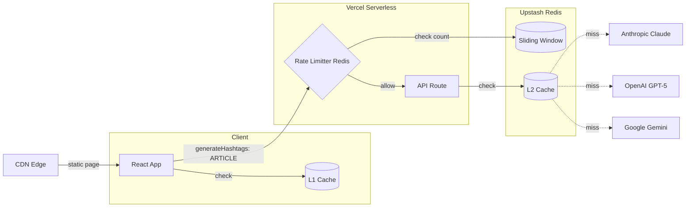

# HashtagGeneratorPro — Internal Architecture

## Overview

HashtagGeneratorPro is a Next.js 15 App Router application that generates hashtags from text using three AI providers (Claude Opus, GPT-5, Gemini). The app is designed around a clear static/dynamic split: all SEO-critical content is statically generated at build time, while the interactive generator hydrates on the client and communicates with server-side API routes.



---

## Technology Stack


| Layer                 | Technology                                          | Version |
| ----------------------- | ----------------------------------------------------- | --------- |
| Framework             | Next.js (App Router)                                | 15.x    |
| UI                    | React                                               | 19.x    |
| Language              | TypeScript                                          | 5.x     |
| Styling               | Tailwind CSS                                        | 4.x     |
| Rate Limiting & Cache | Upstash Redis                                       | —      |
| AI Providers          | Anthropic SDK, OpenAI SDK, Google Generative AI SDK | Latest  |
| Deployment Target     | Vercel / any Node.js host                           | —      |

---

## Static vs Dynamic Rendering

### Build-Time Static Rendering (Server Components)

The following components render to **pure HTML at build time**. They ship zero JavaScript to the client and are served directly from the CDN:

```
app/layout.tsx          → <html>, <body>, skip-to-content link, Figtree font
app/page.tsx            → Header nav, hero section, social proof bar, use-case cards
components/Footer.tsx   → "Why Use", "How It Works", FAQ sections
components/JsonLd.tsx   → 4 structured data <script> tags (WebApplication, FAQPage, HowTo, BreadcrumbList)
app/sitemap.ts          → /sitemap.xml (generated at build)
app/robots.ts           → /robots.txt (generated at build)
app/not-found.tsx       → Custom 404 page
```

**Why this matters for SEO**: Search engine crawlers see the full page content — headings, paragraphs, FAQ answers, structured data — without executing any JavaScript. The page is fully indexable from the static HTML alone.

### Client-Side Hydration (Client Components)

The `"use client"` boundary starts at `HashtagGenerator.tsx`. These components are server-rendered to HTML during build (so the form is visible immediately), then **hydrated** with JavaScript in the browser to become interactive:

```
components/HashtagGenerator.tsx  → Top-level orchestrator (state, callbacks)
components/MethodTabs.tsx        → Tab selector with keyboard navigation
components/InputForm.tsx         → Title input, textarea, file upload, submit button
components/StatusMessage.tsx     → Loading spinner, error alerts
components/HashtagResults.tsx    → Hashtag chips, copy buttons, timing display
```

**Hydration flow**:

1. Browser receives static HTML — the form is visible and styled immediately
2. React JS bundle loads (~107 kB shared runtime + ~4.6 kB page code)
3. React attaches event listeners to the existing DOM (hydration)
4. The form becomes interactive (typing, tab switching, submitting)

**I chose not to use lazy loading**: The client JS payload is ~4.6 kB for the page. There are no heavy client-side dependencies (unlike the previous project which downloaded ML models to the browser). The overhead of `next/dynamic` or `React.lazy` would be counterproductive at this size.

---

## Request Flow

```
User clicks "Generate Hashtags"
│
├─ 1. useHashtagGenerator hook fires
│
├─ 2. Compute cache key: SHA-256(method + ":" + title + ":" + text)
│
├─ 3. Check browser cache (L1: localStorage)
│   ├─ HIT → Return cached GenerationResult immediately (no network)
│   └─ MISS → Continue to step 4
│
├─ 4. POST /api/generate { method, title, text }
│   │
│   ├─ 5. Create structured request log
│   │
│   ├─ 6. Rate limit check (Upstash Redis, 5 req/60s per IP)
│   │     BLOCKED → return 429
│   │     Redis down → skip, allow request (fail-open)
│   │
│   ├─ 7. Validate input:
│   │   - method ∈ ["claude", "gpt5", "gemini"]
│   │   - text.length >= 20
│   │   - text.length <= 50,000
│   │   - Required API key exists in process.env
│   │
│   ├─ 8. Check server cache (L2: Upstash Redis)
│   │     Key: htgp-srv-{SHA256(method:title:text)}
│   │     HIT → return cached result, skip provider call
│   │     MISS → continue
│   │     Redis down → skip, call provider (fail-open)
│   │
│   ├─ 9. Dispatch to provider:
│   │   ├─ claude → Anthropic SDK → claude-opus-4-6
│   │   ├─ gpt5   → OpenAI SDK   → gpt-5
│   │   └─ gemini → Google AI SDK → gemini-2.5-flash
│   │
│   ├─ 10. Parse LLM output with parseHashtags()
│   │
│   ├─ 11. Write result to server cache (fire-and-forget)
│   │
│   ├─ 12. Return { success: true, result: { hashtags[], durationMs, method } }
│   │
│   └─ finally: compute latencyMs, emit structured JSON log
│
├─ 13. Cache result in localStorage with timestamp
│
└─ 14. Render hashtag chips with copy-to-clipboard
```

---

## Caching Strategy

The app uses a two-tier cache to minimize AI provider calls. Both tiers use SHA-256 content-addressed keys derived from `method:title:text`. Both fail open — if a cache is unavailable, the request proceeds to the next layer.

```
Browser (per-user, per-device)
  L1: localStorage
  Key prefix: htgp-cache-
  TTL: 24h, max 50 entries, LRU eviction
  Effect: no network round-trip for repeated queries
      │ miss
      ▼
Server (cross-user, global)
  L2: Upstash Redis
  Key prefix: htgp-srv-
  TTL: 24h, automatic expiry via Redis EX
  Effect: user B gets user A's result for the same input
      │ miss
      ▼
AI Provider call
```

### L1 — Client-Side Response Cache (`lib/cache.ts`)

Cached in the browser's `localStorage` using content-addressed keys.


| Parameter      | Value                                                      |
| ---------------- | ------------------------------------------------------------ |
| Key format     | `htgp-cache-{SHA256(method:title:text)}`                   |
| Hash algorithm | SHA-256 via Web Crypto API (`crypto.subtle.digest`)        |
| TTL            | 24 hours                                                   |
| Max entries    | 50                                                         |
| Eviction       | LRU — when at capacity, the 10 oldest entries are removed |
| Scope          | Per-browser, per-origin                                    |

**Cache behavior**:

- Same input + same method = instant cached result (no API call)
- Same input + different method = separate cache entry (allows model comparison)
- Changing even one character in the input = new cache key (SHA-256 avalanche effect)
- "Clear" button removes the current method's result from React state only
- "Reset" button wipes all `htgp-cache-*` entries from localStorage

### L2 — Server-Side Response Cache (`lib/server-cache.ts`)

Cross-user Redis cache that deduplicates identical requests across all users. If user A generates hashtags for a viral article, user B gets the cached result without an AI provider call.


| Parameter      | Value                                                  |
| ---------------- | -------------------------------------------------------- |
| Key format     | `htgp-srv-{SHA256(method:title:text)}`                 |
| Hash algorithm | SHA-256 via`crypto.subtle.digest` (Node.js 18+)        |
| TTL            | 24 hours (Redis`EX` option)                            |
| Eviction       | Automatic TTL-based expiry                             |
| Scope          | Global, all users                                      |
| Fail behavior  | Fail-open — cache errors are caught, request proceeds |

The Redis client uses the same lazy-singleton + env-var gating pattern as `lib/rate-limit.ts`. It is only created if `UPSTASH_REDIS_REST_URL` and `UPSTASH_REDIS_REST_TOKEN` are set. Without those env vars, server caching is silently disabled.

The two SHA-256 implementations are intentionally separate. `lib/cache.ts` runs in the browser, `lib/server-cache.ts` runs on the server. Sharing code across the build boundary would couple the client and server bundles.

### Session Persistence (`hooks/useLocalStorage.ts`)

User input (title, text, selected method) is persisted to localStorage with debounced writes (500ms). This survives page reloads.


| Key           | Value                     |
| --------------- | --------------------------- |
| `htgp-title`  | Last entered title string |
| `htgp-text`   | Last entered text string  |
| `htgp-method` | Last selected method ID   |

---

## Rate Limiting

### Application-Level (`lib/rate-limit.ts`)

Per-IP rate limiting using Upstash Redis with a sliding window algorithm. This runs before input validation or AI provider calls, so abusive requests are rejected at the earliest possible point in the pipeline.


| Parameter     | Value                                                        |
| --------------- | -------------------------------------------------------------- |
| Algorithm     | Sliding window (`@upstash/ratelimit`)                        |
| Limit         | 5 requests per 60 seconds per IP                             |
| IP source     | `x-forwarded-for` header (first entry), fallback `127.0.0.1` |
| Fail behavior | Fail-open — if Redis is down, requests proceed              |

The rate limiter uses a lazy singleton: the Redis client is created on first use and only if `UPSTASH_REDIS_REST_URL` and `UPSTASH_REDIS_REST_TOKEN` are set. Without those env vars, rate limiting is silently disabled.

### Provider-Level

Each AI provider also enforces its own per-API-key rate limits independently. When a provider returns HTTP 429, the route returns it to the client as `{ code: "RATE_LIMITED" }`. The two-tier cache reduces rate limit pressure — identical requests are served from cache without touching any provider.

---

## Observability

### Structured Logging (`lib/logger.ts`)

Every API request emits exactly one structured JSON log line via `console.log(JSON.stringify(...))`. The log object is created at the top of the handler, populated as the request progresses, and emitted in a `finally` block so it is written regardless of outcome.


| Field        | Type            | Description                                        |
| -------------- | ----------------- | ---------------------------------------------------- |
| `requestId`  | `string`        | UUID v4, unique per request                        |
| `timestamp`  | `string`        | ISO 8601 when the request started                  |
| `method`     | `string | null` | AI provider, null if request failed before parsing |
| `ip`         | `string`        | Client IP from`x-forwarded-for`                    |
| `latencyMs`  | `number`        | Total request duration in milliseconds             |
| `statusCode` | `number`        | HTTP response status code                          |
| `cacheHit`   | `boolean`       | Whether the server Redis cache returned a result   |
| `error`      | `string | null` | Error message, null on success                     |
| `code`       | `string | null` | Error code (RATE_LIMITED, PROVIDER_ERROR, etc.)    |

Vercel parses structured JSON logs automatically. Logs can be forwarded to Datadog, Axiom, or other aggregators via Vercel Log Drains.

---

## CDN & Deployment Strategy

### Asset Serving (Vercel)


| Asset                                   | Served By                         | Cache Behavior                                                    |
| ----------------------------------------- | ----------------------------------- | ------------------------------------------------------------------- |
| Static HTML pages (`/`, `/404`)         | CDN edge (global)                 | Cached, revalidated on redeploy                                   |
| JS chunks (`/_next/static/chunks/`)     | CDN edge (global)                 | **Immutable** — filenames contain content hashes, cached forever |
| CSS (`/_next/static/css/`)              | CDN edge (global)                 | **Immutable** — content-hashed filenames                         |
| Fonts (Figtree, self-hosted by Next.js) | CDN edge (global)                 | Immutable,`font-display: swap` for no FOIT                        |
| Favicon (`/favicon.svg`)                | CDN edge (global)                 | Cached with long TTL                                              |
| `/sitemap.xml`                          | CDN edge (global)                 | Static, regenerated on build                                      |
| `/robots.txt`                           | CDN edge (global)                 | Static, regenerated on build                                      |
| `POST /api/generate`                    | **Serverless function** (not CDN) | Server Redis cache (L2) for cross-user dedup                      |

### Key Performance Characteristics


| Metric                    | Value        | Notes                       |
| --------------------------- | -------------- | ----------------------------- |
| Page JS (route-specific)  | ~4.6 kB      | Extremely lightweight       |
| Shared JS (React runtime) | ~102 kB      | Standard React 19 + Next.js |
| Time to First Byte        | <50ms        | Static HTML from CDN edge   |
| Time to Interactive       | <200ms       | Small hydration payload     |
| Largest Contentful Paint  | Heading text | No heavy images in viewport |

---

## API Route Design (`app/api/generate/route.ts`)

### Request

```
POST /api/generate
Content-Type: application/json

{
  "method": "claude" | "gpt5" | "gemini",
  "title": "optional title string",
  "text": "content text (20–50,000 characters)"
}
```

### Response — Success (200)

```json
{
  "success": true,
  "result": {
    "hashtags": ["#ai", "#machinelearning", "#deeplearning", "#neural", "#coding"],
    "durationMs": 1234,
    "method": "claude"
  }
}
```

### Response — Errors


| Status | Code             | Cause                                  |
| -------- | ------------------ | ---------------------------------------- |
| 400    | `INVALID_INPUT`  | Bad method, text too short/long        |
| 429    | `RATE_LIMITED`   | Application or provider rate limit hit |
| 500    | `PROVIDER_ERROR` | AI provider call failed                |
| 503    | `MISSING_KEY`    | API key not set in environment         |

### Pipeline

```
create log → rate limit → validate → server cache check → call AI → cache result → respond → emit log
```

The `finally` block guarantees a log line is emitted for every request, including failures.

### Security

- Provider modules use `import "server-only"` to prevent accidental client bundling.
- Input is validated and bounded (20–50,000 characters) before any provider call.
- Per-IP rate limiting rejects abusive traffic before it reaches the AI providers.

### Security Headers (`next.config.ts`)

Four HTTP response headers are set on every response:


| Header                      | Value                                          | Purpose                                                                                                                |
| ----------------------------- | ------------------------------------------------ | ------------------------------------------------------------------------------------------------------------------------ |
| `X-Content-Type-Options`    | `nosniff`                                      | Prevents browsers from guessing content types. Without it, a browser could execute a JSON response as HTML/JavaScript. |
| `X-Frame-Options`           | `DENY`                                         | Prevents clickjacking by blocking the page from being embedded in iframes.                                             |
| `Referrer-Policy`           | `strict-origin-when-cross-origin`              | Limits URL information sent to third parties. Cross-origin requests receive only the origin, not the full path.        |
| `Strict-Transport-Security` | `max-age=63072000; includeSubDomains; preload` | Forces HTTPS for 2 years. Vercel applies this on`*.vercel.app` automatically, but custom domains need it explicitly.   |

---

## File Structure

```
HashtagGeneratorPro/
├── app/
│   ├── layout.tsx                 # Root layout, fonts, metadata, skip-link
│   ├── page.tsx                   # Hero, social proof, use cases
│   ├── globals.css                # Tailwind v4 theme, animations, a11y
│   ├── sitemap.ts
│   ├── robots.ts
│   ├── not-found.tsx
│   └── api/generate/
│       └── route.ts               # Rate limit → validate → cache → AI → respond
├── components/
│   ├── HashtagGenerator.tsx       # Client: orchestrator
│   ├── MethodTabs.tsx             # Client: tab selector
│   ├── InputForm.tsx              # Client: form inputs + file upload
│   ├── HashtagResults.tsx         # Client: hashtag chips + copy
│   ├── StatusMessage.tsx          # Client: spinner + error alerts
│   ├── NavBar.tsx                 # Client: responsive nav
│   ├── FaqAccordion.tsx           # Client: animated accordion
│   ├── ArchitectureDiagram.tsx    # Static: inline SVG diagram
│   ├── Footer.tsx                 # Static: features, how-it-works, FAQ
│   └── JsonLd.tsx                 # Static: 4 structured data schemas
├── lib/
│   ├── types.ts                   # Shared types and constants
│   ├── prompts.ts                 # System prompt + user prompt builder
│   ├── parse-hashtags.ts          # LLM output parser
│   ├── clipboard.ts               # Copy-to-clipboard utility
│   ├── cache.ts                   # Browser cache (L1, localStorage)
│   ├── server-cache.ts            # Server cache (L2, Upstash Redis)
│   ├── rate-limit.ts              # Per-IP rate limiter (Upstash Redis)
│   ├── logger.ts                  # Structured JSON request logging
│   └── providers/
│       ├── claude.ts              # Anthropic SDK
│       ├── openai.ts              # OpenAI SDK
│       ├── gemini.ts              # Google AI SDK
│       └── index.ts               # Provider registry + dispatch
├── hooks/
│   ├── useHashtagGenerator.ts     # Cache → API → state
│   └── useLocalStorage.ts         # Persistent localStorage with debounce
├── docs/
│   ├── ARCHITECTURE.md            # This file
│   └── adr/
│       ├── 001-static-dynamic-split.md
│       ├── 002-fail-open-rate-limiting.md
│       ├── 003-two-tier-caching.md
│       └── 004-provider-isolation.md
├── next.config.ts                 # Security headers, build config
├── tsconfig.json
├── postcss.config.mjs
└── package.json
```

---

## SEO Architecture

### Metadata (Next.js Metadata API in `layout.tsx`)

- Title with keyword-rich template
- Description targeting "ai hashtag generator", "free hashtag tool"
- Open Graph tags with image, locale, site name
- Twitter Card (summary_large_image)
- Canonical URL
- Extended keyword list

### Structured Data (JSON-LD in `JsonLd.tsx`)


| Schema           | Purpose                                                             |
| ------------------ | --------------------------------------------------------------------- |
| `WebApplication` | Rich result for the tool — name, description, price (free), rating |
| `FAQPage`        | 5 Q&A pairs — eligible for FAQ rich snippets in Google             |
| `HowTo`          | 4-step process — eligible for HowTo rich snippets                  |
| `BreadcrumbList` | Breadcrumb trail for SERPs                                          |

### Static Content for Crawlers

All SEO-critical content renders as static HTML without JavaScript:

- H1 heading with primary keyword
- Descriptive intro paragraph
- Use-case section targeting platform-specific searches
- Social proof bar
- "Why Use" feature grid
- "How It Works" ordered steps
- FAQ with 5 keyword-rich questions
- Footer with brand mention

---

## Accessibility


| Feature                 | Implementation                                                             |
| ------------------------- | ---------------------------------------------------------------------------- |
| Skip-to-content link    | Hidden link in`layout.tsx`, visible on focus                               |
| Keyboard tab navigation | Arrow keys, Home/End in`MethodTabs.tsx`                                    |
| ARIA roles              | `tablist`, `tab`, `tabpanel`, `alert`, `status`, `region`                  |
| Focus management        | Results panel auto-focuses when new results arrive                         |
| Form validation         | `aria-invalid`, `aria-busy`, `aria-describedby`                            |
| Screen reader feedback  | `aria-live="polite"` for status, `aria-live="assertive"` for copy feedback |
| Reduced motion          | `prefers-reduced-motion` disables animations                               |
| Color contrast          | All text meets WCAG 2.1 AA contrast ratios                                 |

---

## Architecture Decision Records

Detailed tradeoff analysis for key decisions lives in `docs/adr/`:


| ADR                                       | Decision                                            |
| ------------------------------------------- | ----------------------------------------------------- |
| [001](adr/001-static-dynamic-split.md)    | Static HTML for SEO, client React for interactivity |
| [002](adr/002-fail-open-rate-limiting.md) | Rate limiting fails open when Redis is down         |
| [003](adr/003-two-tier-caching.md)        | Two-tier cache: browser localStorage + server Redis |
| [004](adr/004-provider-isolation.md)      | Each AI provider is an independent module           |

---

## Future Work

- **Article & tag history**: Track which articles have been submitted and what tags were generated, enabling users to revisit past results and analyze tagging patterns over time. This would require a persistent datastore (e.g., a database or key-value store with user identity) beyond the current stateless cache layer.
